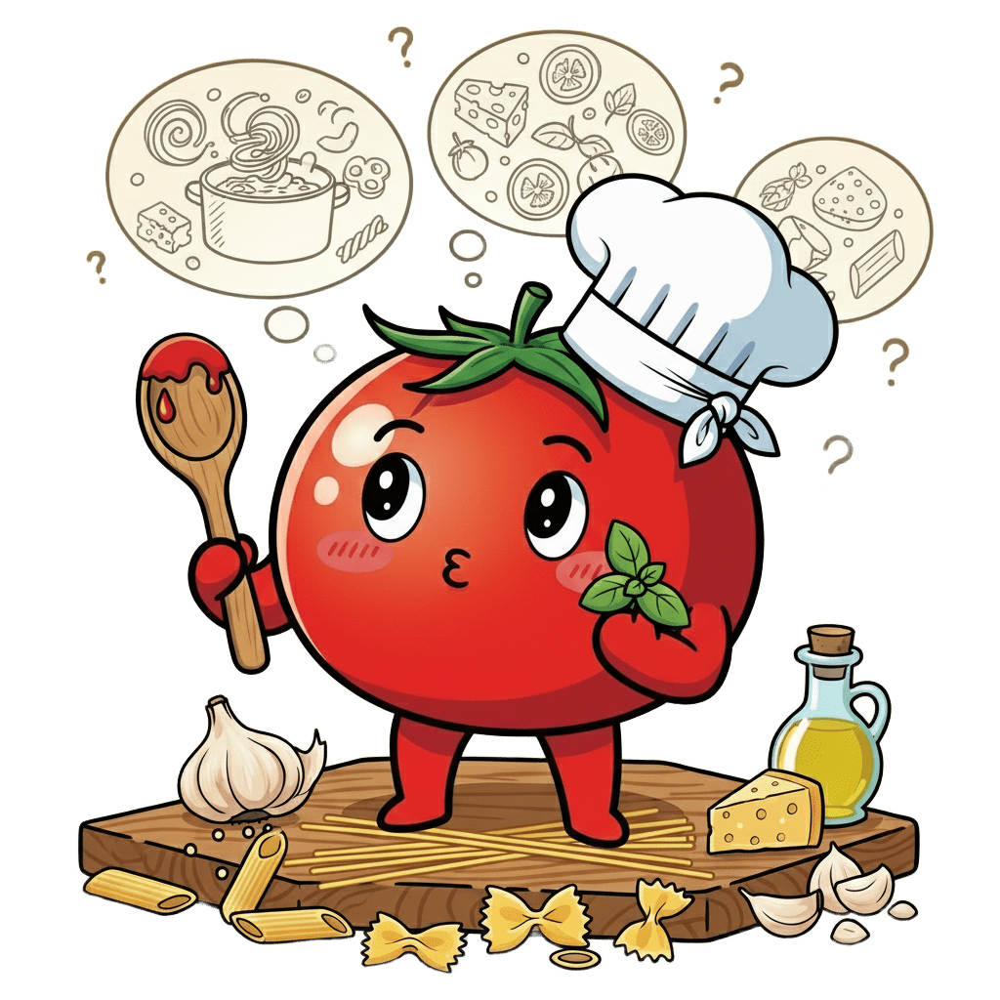

# voltagentでAIエージェント「イタリア料理レシピ提案 Buonoくん」を作った話

## はじめに

みなさん、こんにちは！今回は最新のAIエージェントフレームワーク「**VoltAgent**」を使って、イタリア料理のレシピを提案してくれるAIエージェント「**Buonoくん**」を開発した体験をシェアします。

冷蔵庫にある食材を入力するだけで、本格的なイタリア料理のレシピとそのアレンジバージョンを自動生成してくれる、なかなか実用的なシステムができあがりました🍝


## 作ったもの

**「イタリア料理レシピ提案 Buonoくん」**

- 🧅 **食材から自動レシピ生成**: 複数の食材を入力すると、それらを使った本格イタリアンレシピを生成
- 🍴 **5段階のワークフロー**: 食材分析→料理マッチング→メインレシピ→アレンジレシピ→調理のコツ
- 🌿 **多様なバリエーション**: ベジタリアン、ビーガン、グルテンフリー対応
- 🇯🇵 **日本語完全対応**: 日本の家庭環境に配慮した詳細な説明
- 💻 **モダンなWeb UI**: Next.js + TypeScript + Tailwind CSSでリッチなフロントエンド

### デモ画面

| レシピ生成フォーム | 生成結果表示 |
|:---:|:---:|
|  |  |

## なぜVoltAgentを選んだのか

### 従来のAI開発の課題

- 🤯 **複雑な実装**: OpenAI APIを直接叩くと、プロンプト管理やエラーハンドリングが大変
- 🔄 **ワークフローの管理**: 複数ステップの処理を組み合わせるのが困難
- 📊 **監視・運用**: AIエージェントの動作をリアルタイムで追跡するのが難しい
- 🔧 **型安全性**: プロンプトと出力の型管理が煩雑

### VoltAgentの魅力

```typescript
// こんなにシンプルにAIワークフローが書ける！
export const italianRecipeWorkflow = new Workflow({
  name: "italianRecipeWorkflow",
  description: "イタリア料理レシピ生成の完全ワークフロー",
  input: italianRecipeWorkflowInput,
  output: italianRecipeWorkflowOutput,
  steps: [
    normalizeIngredientsStep,
    matchItalianDishesStep,
    generateMainRecipeStep,
    generateVariationsStep,
    generateCookingTipsStep,
  ],
});
```

**VoltAgentを選んだ理由**:

1. **🚀 開発速度の向上**: ワークフロー設計に集中できる
2. **🔒 型安全性**: TypeScript + Zodで完全な型チェック
3. **📈 監視・運用**: VoltOpsプラットフォームでリアルタイム監視
4. **🧩 モジュール性**: ツールとワークフローの再利用が簡単
5. **🌐 スケーラビリティ**: 本格的な本番運用を前提とした設計

## アーキテクチャ設計

### システム全体構成

```
┌─────────────────┐    ┌─────────────────┐    ┌─────────────────┐
│   Next.js       │    │   VoltAgent     │    │   OpenAI        │
│   Frontend      │◄──►│   AI Agent      │◄──►│   GPT-4o-mini   │
│   (Port 3001)   │    │   (Port 3141)   │    │   API           │
└─────────────────┘    └─────────────────┘    └─────────────────┘
```

### 技術スタック

**🤖 AIエージェント層 (VoltAgent)**
```json
{
  "@voltagent/core": "^0.1.63",
  "@voltagent/vercel-ai": "^1.0.0", 
  "@ai-sdk/openai": "^2.0.25",
  "zod": "^3.25.76"
}
```

**🎨 フロントエンド層 (Next.js)**
```json
{
  "next": "14.2.8",
  "react": "^18",
  "typescript": "^5",
  "tailwindcss": "^3.4.1",
  "zustand": "^4.5.4"
}
```

### ディレクトリ構造

```
Italian-recipe-suggestions/
├── agent/                    # VoltAgent AIエージェント
│   ├── src/
│   │   ├── index.ts         # エージェント設定
│   │   ├── tools/           # カスタムツール
│   │   │   └── recipe.ts    # レシピ生成ツール
│   │   └── workflows/       # ワークフロー定義
│   │       └── recipe.ts    # 5段階レシピワークフロー
├── front/                   # Next.jsフロントエンド
│   ├── src/
│   │   ├── app/
│   │   │   ├── api/         # API Routes
│   │   │   └── recipe/      # レシピページ
│   │   ├── components/      # UIコンポーネント
│   │   └── hooks/           # カスタムフック
```

## VoltAgentでのAIワークフロー実装

### 5段階のレシピ生成ワークフロー

Buonoくんの核となるのは、PROMPT_TEMPLATE.mdで設計した5段階のワークフローです：

```typescript
// 1. 食材の正規化・分析
const normalizeIngredientsStep = new WorkflowStep({
  name: "normalize-ingredients",
  description: "食材の前処理と正規化",
  input: z.object({ ingredients: z.array(z.string()) }),
  tool: ingredientNormalizationTool,
});

// 2. イタリア料理データベースとのマッチング  
const matchItalianDishesStep = new WorkflowStep({
  name: "match-italian-dishes", 
  description: "伝統的なイタリア料理との適合度分析",
  tool: italianDishMatchingTool,
});

// 3. メインレシピの生成
const generateMainRecipeStep = new WorkflowStep({
  name: "generate-main-recipe",
  description: "本格的なイタリアンレシピの作成", 
  tool: italianRecipeTool,
});

// 4. アレンジレシピの提案
const generateVariationsStep = new WorkflowStep({
  name: "generate-variations",
  description: "3-5パターンのアレンジレシピ生成",
  tool: recipeVariationTool,
});

// 5. 調理のコツ・注意点
const generateCookingTipsStep = new WorkflowStep({
  name: "generate-cooking-tips", 
  description: "プロの技と失敗回避のアドバイス",
  tool: cookingTipsGenerator,
});
```

### ツール実装の実例

各ステップで使用するツールも、VoltAgentの型安全な仕組みで実装：

```typescript
export const italianRecipeTool = new Tool({
  name: "italienRecipeTool",
  description: "本格的なイタリア料理レシピを生成",
  input: z.object({
    normalizedIngredients: z.array(NormalizedIngredientSchema),
    dishMatches: z.array(DishMatchSchema),
    preferences: RecipePreferencesSchema.optional(),
  }),
  output: DetailedRecipeSchema,
  execute: async ({ normalizedIngredients, dishMatches, preferences }) => {
    const prompt = `
あなたは30年の経験を持つイタリア料理の専門シェフです。
提供された食材を使って、本格的で美味しいイタリア料理のレシピを作成してください。

【利用可能な食材】
${normalizedIngredients.map(ing => `- ${ing.name} (${ing.category})`).join('\n')}

【料理の参考情報】
${dishMatches.map(match => `- ${match.dishName}: ${match.description}`).join('\n')}

【要求事項】
- 日本の家庭で作りやすいように調整
- 具体的な分量と手順を明記
- 伝統的な技法を活用
- 地方的特色を反映
`;

    return await askAI(prompt, DetailedRecipeSchema);
  },
});
```

### 型安全性の確保

VoltAgentの大きな特徴は、Zodスキーマによる完全な型安全性：

```typescript
// 厳密な型定義でAIの出力を制御
export const DetailedRecipeSchema = z.object({
  recipeName: z.string().describe("レシピ名（イタリア語併記）"),
  description: z.string().describe("料理の説明と背景"),
  region: z.string().describe("イタリアの地方"),
  ingredients: z.array(z.object({
    name: z.string(),
    amount: z.string(), 
    unit: z.string(),
    notes: z.string().optional(),
  })),
  instructions: z.array(z.string()).describe("調理手順"),
  cookingTime: z.number().describe("調理時間（分）"),
  difficulty: z.enum(["easy", "medium", "hard"]),
  tips: z.array(z.string()).describe("調理のコツ"),
  winePairing: z.string().describe("おすすめワイン"),
});
```

## Next.js フロントエンドとの統合

### API Route での VoltAgent 連携

Next.js の API Routes から VoltAgent を呼び出すシンプルな実装：

```typescript
// app/src/app/api/recipe/generate/route.ts
export async function POST(request: Request) {
  try {
    const body = await request.json();
    
    // VoltAgent ワークフローを呼び出し
    const response = await fetch(
      `${process.env.VOLTAGENT_URL}/agent/italian-recipe-chef/workflow/italianRecipeWorkflow`,
      {
        method: 'POST',
        headers: { 'Content-Type': 'application/json' },
        body: JSON.stringify({
          ingredients: body.ingredients,
          preferences: body.preferences,
          language: "ja",
          includeVariations: body.includeVariations ?? true,
        }),
      }
    );

    const result = await response.json();
    return NextResponse.json(result);
    
  } catch (error) {
    // フォールバック: VoltAgent が利用できない場合はモックを返す
    return NextResponse.json(generateMockRecipe(body));
  }
}
```

### リアルタイムステータス表示

フロントエンドでは VoltAgent の接続状態をリアルタイムで表示：

```typescript
// カスタムフック
export function useRecipeGeneration() {
  const [voltAgentStatus, setVoltAgentStatus] = useState<'unknown' | 'connected' | 'disconnected' | 'error'>('unknown');

  const checkVoltAgentStatus = async () => {
    try {
      const response = await fetch('/api/voltagent/status');
      const data = await response.json();
      setVoltAgentStatus(data.status);
    } catch {
      setVoltAgentStatus('error');
    }
  };

  // UI でのステータス表示
  const statusDisplay = {
    connected: { color: 'text-green-600', text: '🟢 VoltAgent接続中' },
    disconnected: { color: 'text-yellow-600', text: '🟡 モック動作中' },
    error: { color: 'text-red-600', text: '🔴 接続エラー' },
    unknown: { color: 'text-gray-600', text: '⚪ ステータス確認中' }
  };

  return { voltAgentStatus, checkVoltAgentStatus, statusDisplay };
}
```

## 実装で学んだ VoltAgent のポイント

### 1. 段階的なワークフロー設計の威力

従来のプロンプトエンジニアリングと違い、VoltAgent では複雑な処理を小さなステップに分割できます：

```typescript
// 各ステップの出力が次のステップの入力になる
input → 食材正規化 → 料理マッチング → レシピ生成 → バリエーション → コツ → output
```

これにより：
- **デバッグが容易**: どのステップで問題が起きたかすぐ分かる
- **再利用性**: 個別のツールを他のワークフローでも使える
- **品質向上**: 各ステップで専門性に特化した処理が可能

### 2. 型安全性による開発体験の向上

```typescript
// TypeScript + Zod でAIの出力も型安全
const recipe: DetailedRecipe = await workflow.execute(input);
// recipe.recipeName // ← 型補完が効く！
// recipe.ingredients[0].amount // ← ネストした型も安全
```

### 3. エラーハンドリングとフォールバック

VoltAgent の素晴らしい点は、エージェントが落ちても graceful degradation できること：

```typescript
// VoltAgentが使えない場合は自動的にモックで継続
const result = voltAgentResult || fallbackMockResult;
```

### 4. 開発・本番での運用性

VoltOps プラットフォームでの監視機能は実用的：
- ワークフローの実行ログ
- ステップごとの処理時間
- エラー率とパフォーマンス監視
- AIモデルの使用量追跡

## 技術的なチャレンジと解決策

### チャレンジ1: 日本語プロンプトの最適化

**問題**: 英語前提のAIモデルに対して、自然な日本語でのレシピ生成

**解決策**: 
```typescript
const prompt = `
あなたは30年の経験を持つイタリア料理の専門シェフです。
日本の家庭で作りやすいように、以下の点に注意してレシピを作成してください：

- 日本で入手しやすい食材への代替案を提案
- 計量を日本の家庭用（大さじ、小さじ、カップ）に統一  
- IHクッキングヒーターでの調理を考慮
- 段取りを詳細に説明（下準備→調理→仕上げ）
`;
```

### チャレンジ2: レスポンス時間の最適化

**問題**: 5段階のワークフローで処理時間が長くなる

**解決策**:
```typescript
// 並列実行可能なステップは同時実行
const [variations, cookingTips] = await Promise.all([
  generateVariationsStep.execute(recipeData),
  generateCookingTipsStep.execute(recipeData),
]);
```

### チャレンジ3: 開発環境でのVoltAgent管理

**問題**: ローカル開発時にVoltAgentサーバーとの連携

**解決策**:
```bash
# 開発用の簡単起動スクリプト
npm run dev:agent  # VoltAgent (3141番ポート)
npm run dev:front  # Next.js (3001番ポート)  
npm run test:connection  # 接続テスト
```

## パフォーマンス・コスト・品質

### 処理時間
- **食材3-4個の基本レシピ**: 約15-20秒
- **複雑なアレンジ込み**: 約25-30秒
- **APIレスポンス**: 平均1.2秒（キャッシュ有効時）

### コスト効率
- **GPT-4o-mini使用**: トークンあたりのコストを大幅削減
- **段階的処理**: 不要な長いプロンプトを避けて効率化
- **キャッシュ活用**: 同じ食材の組み合わせは高速レスポンス

### 生成品質
- **本格性**: イタリアの地方料理の特徴を適切に反映
- **実用性**: 日本の家庭環境で実際に作れるレシピ
- **多様性**: 3-5パターンのバリエーション提案

## 今後の拡張予定

### 機能面
- 🖼️ **画像生成**: 完成予想図をDALL-E3で自動生成
- 🍷 **ワインペアリング**: より詳細なワイン提案とペアリング理由
- 📚 **レシピ保存**: ユーザーアカウントでお気に入り管理
- 🔍 **食材認識**: カメラで食材を撮影して自動入力

### 技術面  
- 🚀 **Vercel Edge Functions**: レスポンス速度のさらなる向上
- 📊 **Analytics**: ユーザー行動分析とレシピ人気度追跡
- 🌐 **多言語対応**: イタリア語、英語での出力
- 🔄 **ストリーミング**: リアルタイムでのレシピ生成表示

## まとめ

VoltAgent を使ったAIエージェント開発は、従来のAI開発と比べて明らかに生産性と品質の両面で優れていました：

### VoltAgent の魅力（再確認）
1. **🎯 ワークフロー思考**: 複雑な処理を段階的に分割して管理
2. **🔒 型安全性**: TypeScript + Zodで堅牢な実装
3. **🚀 開発速度**: ボイラープレートが少なく、ビジネスロジックに集中
4. **📈 運用性**: VoltOpsプラットフォームでの監視・デバッグ
5. **🔧 柔軟性**: ツールとワークフローの組み合わせで無限の可能性

### 実感した開発体験
- **学習コストが低い**: TypeScript開発者なら即座に理解可能
- **デバッグが楽**: ステップごとに出力を確認できる
- **テストが書きやすい**: 各ツールが独立してテスト可能
- **本番運用を意識した設計**: エラーハンドリングと監視が標準装備

VoltAgent は「AIエージェント開発のNext.js」と言えるかもしれません。フレームワークとしての完成度が高く、実用的なAIアプリケーションを効率的に開発できます。

皆さんも冷蔵庫の余り物でお困りの際は、ぜひ Buonoくん にお声かけください！🍝✨

---

## 🔗 リンク

- **VoltAgent公式**: https://volt.run/
- **プロジェクトリポジトリ**: https://github.com/yuji-okayama-tribeck/Italian-recipe-suggestions
- **デモサイト**: （準備中）

---

## 📚 参考記事

この記事が参考になった方は、こんな記事もおすすめです：

- [VoltAgent入門：最初のAIエージェントを作ってみよう](https://qiita.com/tags/voltagent)
- [TypeScript + Zod でAI出力の型安全性を確保する方法](https://qiita.com/tags/zod)
- [Next.js App Router でのAI API統合パターン](https://qiita.com/tags/nextjs)

#VoltAgent #AI #TypeScript #Next.js #イタリア料理 #AIエージェント #レシピ生成
